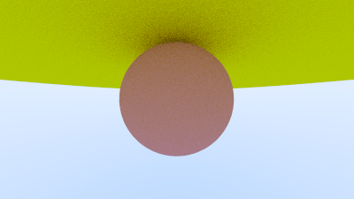

# CPU Path Tracer

A simple C++ implementation of a CPU-based path tracer for realistic image rendering.

## Project Structure

- `src/core/` - Core math classes (Vec3, Ray, Random)
- `src/geometry/` - Scene geometry (Hittable, Sphere, Plane)
- `src/materials/` - Material models (Material, Lambertian, Metal, Dielectric)
- `src/scene/` - Scene management (Scene, Camera)
- `src/renderer/` - Rendering engine (Renderer)
- `src/utils/` - Utilities (Image, ImageWriter)
- `include/` - Third-party libraries
- `output/` - Rendered images

## Building

```bash
mkdir build
cd build
cmake ..
make
```

## Usage

```bash
./PathTracingRenderer
```

## Features

- [ ] Basic ray tracing
- [ ] Sphere and plane geometry
- [ ] Multiple material types (Lambertian, Metal, Dielectric)
- [ ] Anti-aliasing
- [ ] Simple path tracing integration

## Dependencies

- CMake 3.15+
- C++17 compatible compiler
- STB library (included)

## Gallery


